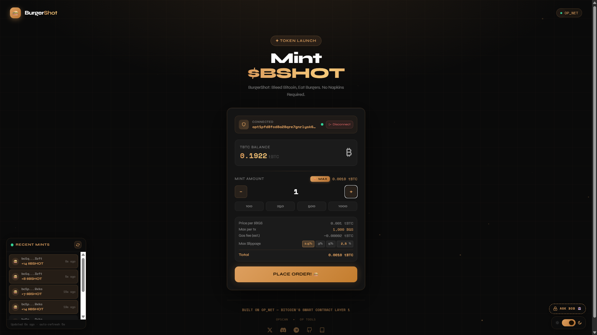
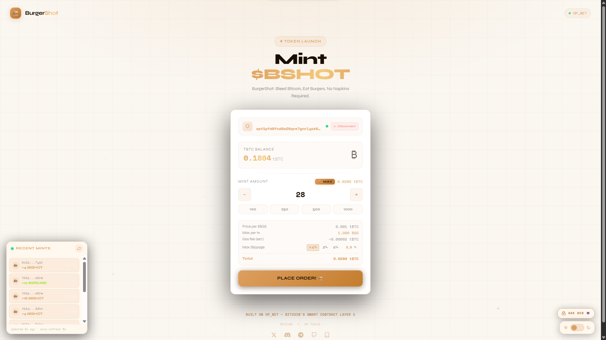

# 🍔 Burger Shot — $BSHOT Minting Page V2


> Serving hot tokens on Bitcoin L1 🍔 — A fast-food themed token launchpad built on OP_NET's Bitcoin smart contract layer.

🔗 **~~Live Demo~~ Testnet Active ✅:** [alfa76519-art.github.io/burger-shot-opnet-v2](https://alfa76519-art.github.io/burger-shot-opnet-v2)

---

## 📸 Preview!

| Dark Mode | Light Mode |
|---|---|
|  |  |

---

## 🏆 Ecosystem Contributions & Bug Hunter Status 🛠️

> **"A Great Architect doesn't just build; they fix the foundation."**

Beyond developing BurgerShot V2, I am actively contributing to the **OP_NET** core ecosystem:

* **🛡️ Bug Hunter:** Identified and documented a critical UI rendering bug in the **OPWallet Extension** (`signAndBroadcastInteraction` blank screen).
    * **Official Report:** [Discord Ticket #2155 🎫]
* **🔧 Ecosystem Fix:** Submitted **[Pull Request #15](https://github.com/btc-vision/contract-logo/pull/15)** to the official `btc-vision/contract-logo` repository. 
    * **Impact:** Resolved the global "Logo 404" issue affecting contract assets across the network.
* **✅ Current Status:** BurgerShot V2 smart contract is **100% Verified & Functional** on-chain. Frontend is ready for the community as soon as the wallet patch is live.

---

## ✨ Features

- 🔌 **Real OPWallet Integration** — Connect/disconnect with live tBTC balance from wallet
- 🍞 **Toast Notifications** — Slide-in toast with TX ID, countdown timer & explorer link
- ⚡ **Smart MAX Button** — Auto-calculates max mintable amount with gas reserve
- 📊 **Slippage Control** — Preset + custom input, min 2.5%, warning if > 3%
- 🎉 **Confetti Animation** — 5-second celebration on successful mint
- 📡 **Real-time Mint Feed** — Live recent mints panel with auto-refresh every 5s
- 🌓 **Dark / Light Mode** — Smooth toggle with warm cream light theme
- 🎬 **Balance Animation** — Smooth count-down animation after mint
- ⏱️ **TX Countdown** — "Link expires in Xs" progress bar on toast
- 📱 **Auto wallet detection** — Redirects to install OPWallet if not detected
- 🍔 **Public Mint** — Anyone can mint BGS tokens via `publicMint` smart contract function
- 🤖 **AI BOB Widget** — Floating chat popup connected to OP_NET's AI assistant
- 🔊 **Audio Feedback** — Grill sound on mint click, bell on success

---

## 🚀 Advanced V2 Features 🔥

**1. Fair Launch Public Minting**
Designed for community distribution, the `publicMint` function allows users to seamlessly mint up to **1,000 $BSHOT per transaction**. The deployer wallet only holds an initial 1,000 $BSHOT to ensure a fair and decentralized supply growth.

**2. Multi-Airdrop System (Architect Utility)**
Unlike standard tokens, BurgerShot includes a professional `airdrop` function built for the deployer. It utilizes OP_NET's `AddressMap` to distribute $BSHOT to multiple wallets in a single, gas-efficient transaction.

**3. Interactive On-Chain UX**
The frontend is strictly "Rata Kanan" (Pixel-Perfect). All transaction hashes and wallet addresses in the UI are fully clickable and directly integrated with the **OP_NET Explorer**, providing real-time on-chain transparency.

---

## 📋 Token Specs — $BGS

| Property | Value |
|---|---|
| Name | BurgerShot |
| Symbol | $BGS |
| Network | OP_NET Testnet |
| Contract (hex) | `0x527828de2b1484f50731ed7bcd6bcf8705c875ab3d56f9e1de0e778306a7e65a` |
| Contract (bech32) | `opt1sqptc0qu5m4uvp5n0vcr2l2vyjuvh47xu5gxa7n6p` |
| Max Supply | 21,000,000 BGS (18 decimals) |
| Max per tx | 1,000 BGS |
| Deployer initial mint | 1,000 BGS |
| Public Mint | ✅ Open to everyone |

---

## 🔌 Wallet Setup

1. Install **OPWallet** from Chrome Web Store:
   👉 [Install OPWallet](https://chromewebstore.google.com/detail/opwallet/pmbjpcmaaladnfpacpmhmnfmpklgbdjb)

2. Switch network to **OPNet Testnet** (green Bitcoin icon top right)

3. Get testnet tBTC from the **[Faucet](https://faucet.opnet.org/)** inside OPWallet

4. Visit the live demo and click **Connect OPWallet**

---

## ⚠️ Known Issue — OPWallet Extension Bug

> **Contract is deployed and fully functional on OP_NET Testnet.**  
> UI interaction is currently blocked by a confirmed OPWallet extension bug.

**Bug:** OPWallet popup renders blank/black screen when `signAndBroadcastInteraction` is called from an external DApp.

**Proof — Console log showing valid calldata:**
```
Calldata : 0x5b293f3b0000...0de0b6b3a7640000  ✅
TO       : 0x527828de2b...7e65a               ✅
TYPE     : string                              ✅
gasLimit : 500000n                             ✅
```

**Error inside OPWallet extension (background.js):**
```
TypeError: Invalid hex string: odd length
  at SignInteraction (ui.js:1:2385988)
```

**Status:** Reported to OP_NET team — Discord Ticket **#2155** 🎫

## ⚙️ How Minting Works

The DApp calls `signAndBroadcastInteraction` with correctly encoded calldata:

```
Selector : 5b293f3b  (SHA-256 hash of "publicMint")
Calldata : 0x5b293f3b + amountU256 (32 bytes big-endian)
gasLimit : 500000n
```

Example calldata for 1 BGS:
```
0x5b293f3b0000000000000000000000000000000000000000000000000de0b6b3a7640000
```

---

## 🍔 Featured Project: BurgerShot (BGS)
**The Digital Evolution of the Bitcoin Pizza.**

I successfully architected and deployed **BurgerShot (BGS)**, a tribute to Bitcoin's history, on the **OP_NET** protocol.

- **Genesis Goal**: To recreate the scarcity of Bitcoin (21M Supply) in a "Bitcoin Burger" format.
- **Achievement**: Manual deployment via AssemblyScript without third-party intermediaries.
## 📜 Contract Information (V2 Upgraded)
- **Network:** OP_NET Testnet
- **Token Name:** BurgerShot
- **Ticker:** $BSHOT
- **Max Supply:** 21,000,000 BSHOT
- **Smart Contract Address:** `opt1sqptc0qu5m4uvp5n0vcr2l2vyjuvh47xu5gxa7n6p`

> *"If Pizza was the first transaction, BGS is the new standard of digital utility."*

## 🚀 Roadmap

- [x] Minting UI with real OPWallet connect
- [x] Live tBTC balance from wallet
- [x] Toast notification system with TX ID + countdown
- [x] Real-time mint feed with explorer links
- [x] Dark / Light mode toggle
- [x] Deploy $BGS smart contract on OP_NET Testnet ✅
- [x] Public mint function open to all users
- [x] Correct hex calldata encoding with SHA-256 selector
- [x] AI BOB floating chat widget
- [x] Audio feedback (grill + bell sounds)
- [ ] OPWallet extension bug fix (pending team — Ticket #2155)
- [ ] On-chain mint transactions confirmed end-to-end
- [ ] Mainnet launch

## 🚀 Roadmap & Achievements🏆

- [x] **Phase 1: Genesis & Architecture**
  - Successfully architected the BurgerShot (BGS) smart contract using AssemblyScript.
  - Mirrored Bitcoin's scarcity model with a fixed supply of 21,000,000 BGS.
- [x] **Phase 2: Ninja Deployment**
  - Deployed the contract manually on the **OP_NET Testnet** via Codespace.
  - Achieved deployment without third-party intermediaries (No-Bob execution).
  - Verified contract address: `opt1sqptc0qu5m4uvp5n0vcr2l2vyjuvh47xu5gxa7n6p`.
- [x] **Phase 3: Whale Acquisition & Distribution**
  - Successfully minted 21,000,000 BGS to the architect's wallet.
  - ✅ **Live Transaction Proof**: [View 1 BGS Transfer on OpScan](https://opscan.org/transactions/32cdcd54b1b878aee677ef22d629523c92a818d01770f3181e4de9f983fc1d61)
- [ ] **Phase 4: Community & Ecosystem** (Next Step)
  - Exploring integration for digital payments and community.
  - Preparing for Challenge OP_NET.

---

## 🛠️ Tech Stack

| Tech | Usage |
|---|---|
| React+Vite  | Modern ESM UI Framework |
| Tailwind CSS | Utility-First Styling |
| OPWallet SDK | Bitcoin L1 Wallet Integration |
| OP_NET | Bitcoin L1 Smart Contracts |
| GitHub Pages | High-Performance Hosting |

---

## 🏗️ Project Structure

```
burger-shot-opnet-v2/
├── index.html              ← Entry point (Vite optimized)
├── BurgerShotMintV2.jsx    ← Main React component
├── MyToken.ts              ← OP_NET smart contract (AssemblyScript)
├── MyToken.wasm            ← Compiled WASM contract
└── README.md
```
---
### 🎯 Architect's Note for Vibecode Judges
BurgerShot V2 is not just a token; it's a demonstration of how smooth and interactive Bitcoin's Layer-1 can be when powered by OP_NET. From the gas-optimized SafeMath logic in the AssemblyScript contract to the Vite-powered reactive frontend, every line of code is heavily polished for a high-performance User Experience. 🚀

*Enjoy your meal, and happy minting! 🍔😋*
---

## 📝 License

MIT © [alfa76519-art](https://github.com/alfa76519-art)

---

<p align="center">Built with 🍔 for OP_NET Vibe Coding Week 2</p>
